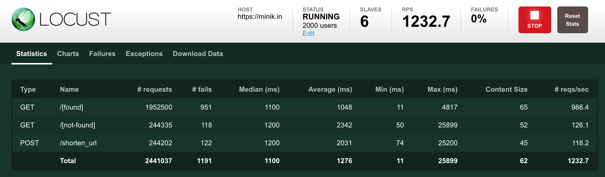

# minikin
[](https://travis-ci.org/cliffxuan/minikin)  [](https://codeclimate.com/github/cliffxuan/minikin/test_coverage) [](https://codeclimate.com/github/cliffxuan/minikin/maintainability)
<p align="center">
  <a href="https://minik.in"></a>
</p>
Minikin is a url shortener built in Python with asyncio. It's small in footprint, performant with little resources and yet can scale up big.

## How to use

Check it out using [httpie](https://httpie.org/).

- Create a short url for the 10,000 bitcoin for 2 pizza transaction on the bitcoin blockchain
> http POST https://minik.in/shorten_url url='https://www.blockchain.com/btc/tx/a1075db55d416d3ca199f55b6084e2115b9345e16c5cf302fc80e9d5fbf5d48d'

```
HTTP/1.1 201 Created
Connection: keep-alive
Content-Length: 45
Content-Type: application/json; charset=utf-8
Date: Thu, 09 Aug 2018 10:56:22 GMT
Server: nginx/1.14.0 (Ubuntu)

{
    "shortened_url": "https://minik.in/6ypXVDH"
}
```
- Click this url [https://minik.in/6ypXVDH](https://minik.in/6ypXVDH) or use `httpie`
> http https://minik.in/6ypXVDH
```
HTTP/1.1 302 Found
Connection: keep-alive
Content-Length: 114
Content-Type: application/json
Date: Thu, 09 Aug 2018 10:55:47 GMT
Location: https://www.blockchain.com/btc/tx/a1075db55d416d3ca199f55b6084e2115b9345e16c5cf302fc80e9d5fbf5d48d
Server: nginx/1.14.0 (Ubuntu)

{
    "location": "https://www.blockchain.com/btc/tx/a1075db55d416d3ca199f55b6084e2115b9345e16c5cf302fc80e9d5fbf5d48d"
}
```

## Building Components

- [aiohttp](https://github.com/aio-libs/aiohttp) HTTP server for asyncio
- [asyncpg](https://github.com/MagicStack/asyncpg) A fast PostgreSQL Database Client Library for Python/asyncio
- [postgresql](https://www.postgresql.org/) Used as the persistent data storage
- [redis](https://redis.io) Used as data cache

## Installation

This requires python3.6 and above.

- install pipenv
`pip install pipenv`

- install dependencies
`pipenv install`

- create postgresql database and table
One table with two columns (slug and url) are the minimum needed. The slug, i.e. the path of the short url is the primary key and is indexed.
```
createdb -U postgres minikin
psql -U postgres minikin <<EOF
CREATE TABLE short_url (
    slug CHAR(7),
    url TEXT,
    PRIMARY KEY (slug)
);
EOF
```

- start the server
`pipenv run python minikin/app.py`

- then it should be available
```
======== Running on http://0.0.0.0:8080 ========
(Press CTRL+C to quit)
```

## Running Test

Automated tests are run on travis-ci [https://travis-ci.org/cliffxuan/minikin](https://travis-ci.org/cliffxuan/minikin).

These are 3 types tests currently and integration test will be added later.
- unittest
- flake8 for style
- mypy for type checking

To run these locally:
```
pip install tox
tox
```

## Design decisions and tradeoffs

### shortening algorithm
`full url` -> `md5` -> `base62` -> `take 7`

The hashing algorithm ensures the process is deterministic. 7 characters from 62 candidates allows 3.5 trillion different urls, which should allow the system to grow for 110 years if growing at 1000 per second.

### conflict and hash collision

Hash collision is not protected. If two urls hash into the same string, the latter will override the former. Because the chance of collision is really small, the overhead is not justified. This is also because url shortening is not critical that losing a url would not cause a big loss.

Also because the process is deterministic, the system doesn't check if the url already exists in the database and always performs an upsert.

### concurrency model

Event driven async socket is used instead of multi threading because it can handle more concurrent requests with the same resource compared with threading concurrency model.


### database

Both Postgresql and Redis have good support in asyncio. They work well togehter where Postgres is the persistent data storage and Redis sits in the front as the cache.


## Load Test Benchmark

Load test uses [Locust](https://locust.io/). The script are defined as [locustfile.py](tests/load/locustfile.py).

start the load test:
```
locust -f tests/load/locustfile.py --host=https://minik.in
```

or use the script for running in master/slave mode for leveraging the multi-core CPU.

run without web interface:
```
python tests/load/run.py --host https://minik.in -n 6 --concurrency 2000 --hatch-rate 500
```

run with web interface:
```
python tests/load/run.py --host https://minik.in -n 6 --web
```



Load profile:

- number of urls in db: 5 million
- number of concurrent users: 1,000 ~ 5,000
- traffic distribution
    * 10% POST /shorten_url
    * 10% GET /[NOT FOUND]
    * 80% GET /[FOUND]

Server machine:

- Cloud provider: Google Compute Engine
- Location: London
- Number of vCPU: 2
- RAM: 8GB
- Hard driver: 30GB SSD
- Cost: $50/month
- Number of processes: 5
- Reverse proxy server: Nginx

Test client machine:

- Cloud provider: Vultr
- Location: Amsterdam
- Number of CPU: 6
- RAM: 16GB


Result:

- Request Per Second: 1,000 ~ 1,200
- CPU utilisation: 80% ~ 100%
- Error rates at  based 500,000 requests. These are all 502 Server Error: Bad Gateway. They are caused by upstream server under heavy load and becoming unavailable.
    * 1,000 concurrent connections: 0
    * 2,000 concurrent connections: 0.2%
    * 3,000 concurrent connections: 0.6%
    * 4,000 concurrent connections: 1.9%
    * 5,000 concurrent connections: 2.8%

Limitation:

- the client is in a data center with fast internet connection, so this doesn't represent real world use case.
- the database has only 5 million records, which is about 400MB, so the memory needed for cache is small.

## Scale up and out

Because the state is not shared and the shortening process is determnistic, it can be easily scaled up. several instruments can be used independantly or collectively.

### get better hardware

Increasing the number of CPU should have an immediate impact. With more data, bigger RAM and hard drive will be required to keep or imporove the performance.

### traffic routing

Load balancing and traffic routing and will not only increase the capacity but also reliability. Several strategies can be used independantly or collectively. These include:

- Load balancing - split the load between multiple applications
- Failover routing - active-passive failover
- Geolocation routing - route traffic based on user location
- Geopromixity routing - route traffic based on location of the resource
- Latency routing - route traffic to server which provides the best latency

### scale database

Data and accessing of data can be split so each sub system can only deal with a partition of the data.

- split read and write - the system is heavier on read (url lookup) and lighter on write (short url creation). read operation can use slaves of a master database.
- sharding - without any dependency, data can be split based on the value of slug. for example, if split into 2, anything slug smaller than 1.76T can go to one partition and the rest to the other. It can be split infinitely based on needs as the results from the hashing algorith follows uniform distribution.

